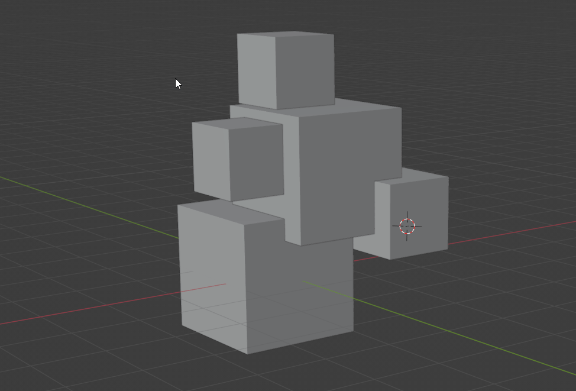

#################
BETTER BOUND BOX
#################

This submodule provides a better BoundBox system for Blender integrations, 
with support for multiple objects at the same time, non destructive transforms operations
and various utility functions to work with.

| 

If you are creating a Blender integration that will deal with 
multiple objects that represents only one model and you need to work with 
its dimensions properties, this module is for you.

It solves all problems related to the default Blender BoundBox system, including problems with
difficulty to get real dimensions data, irregular transforms, problems when dealing with multiple objects.
at the same time. All of this keeping intact the original objects transforms from the model.

*************
Documentation
*************

To build the documentation, run the following command from the root of the

.. code-block:: bash

    python -m pip install sphinx
    python -m pip install sphinx-rtd-theme
    sphinx-build -b html docs/source/ docs/build/html

The documentation will be built under ``docs/build/html``. after that, open the index.html file.
in any browser.

